EXERCICI 1 - GITHUB

Marc Brines Bañuls Exercici 1

Creem un nou repositori amb les dades donades, en aquest cas, ho vegem en la següent imatge.

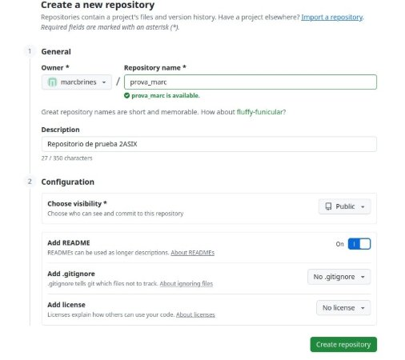

*Fig 1: Configuració del repositori.* En el següent pas instalarem al ordenador el git, ja que no el tinc.

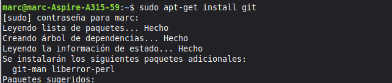

*Fig 2: Instalació de git.*

Fiquem el nom d’usuari i el correu, com que ja tenia creat dirigixc el correu a aquest.

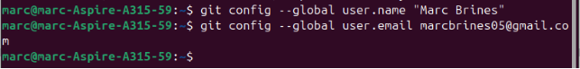

*Fig 3: Usuari i correu git.*

Clonem ara el nostre repositori amb l’enllaç de https.

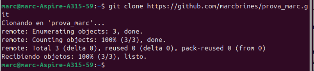

*Fig 4: Clonació del git.* Creem una carpeda on dins crearem un repositori de git.

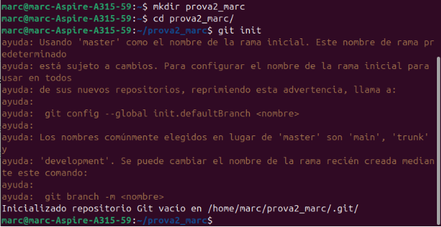

*Fig 5: Creació del repositori.*

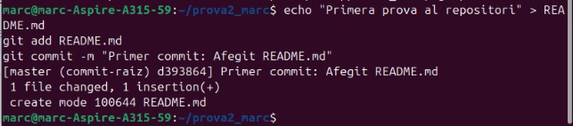

*Fig 6: Primera prova del repositori.*

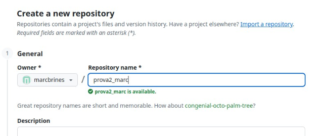

*Fig 7: Cree el repositori desde dins de la pàgina del git.*

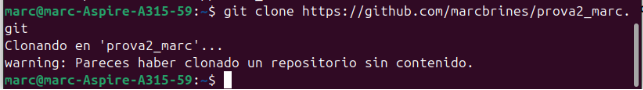

*Fig 8: Connectem el git amb el creat en la web.*

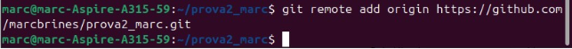

*Fig 9: Enllacem el repositori.*

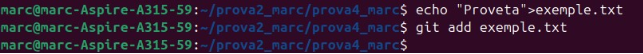

*Fig 10: Cree un fitcher amb un text dins, i l’afegisc a git.*

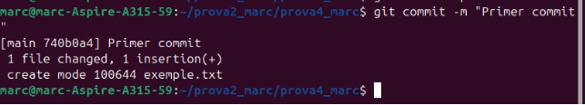

*Fig 11: Fem el primer commit.*

Marc Brines Bañuls Exercici 1

4

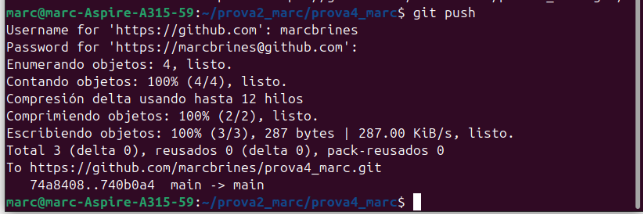

*Fig 12: Fem el mateix, pero ara amb el push (pujar-lo).*

Per a l’apartat anterior, com que hem donava error la màquina una vegada tirava a ficar la contrasenya, he creat un token, on després de demanar l’usuari, l’he pegat, i així he pogut dur a terme el pas anterior.

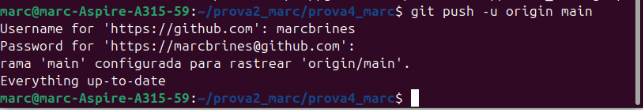

*Fig 13: Pujem al main, ho he fet des de la carpeta creada.*

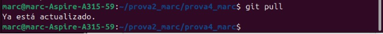

*Fig 14: Primer push i vegem que ja està tot actualitzat.*

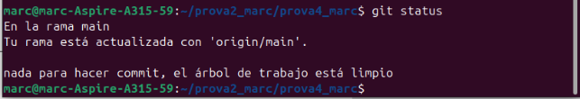

*Fig 15: Faig un “status” que es per a veure l’estat de git.*

En el pas anterior, si hi haguera algo que no està correctament fet o que no està pujat al lloc, ens apareixeria baix en una llista, pero com podem vore ho tenim tot correcte.
Marc Brines Bañuls Exercici 1

5
