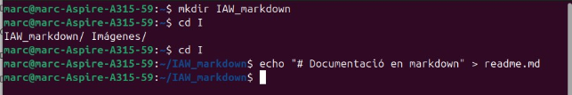
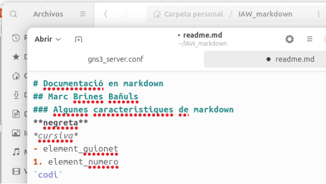
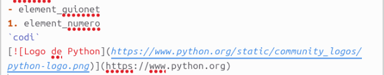
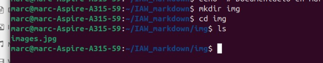
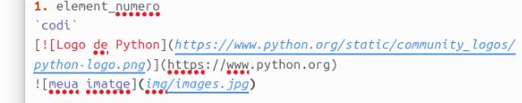
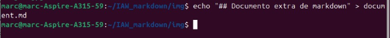
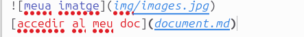
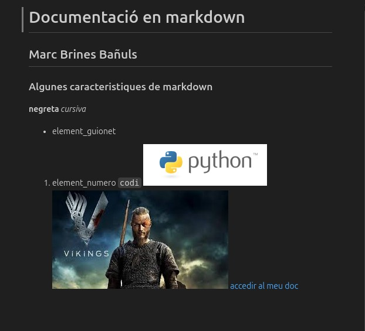

EXERCICI 2 GIT – MARKDOWN

Marc Brines Bañuls 2 ASIX IAW

Primer que res obrim la terminal del nostre ordenador on tenim instal·lat el git, per tal de crear la carpeta i fer el ejercici.

*Fig 1: Creació de directori i readme en markdown.*

Obrim el readme en algún programa per a poder escriure dins i afegir algunes línies en markdown.

*Fig 2: Fitxer readme.*

També anem a afegir una imatge amb un enllaç extern, per tal de practicar una gran part de les nocions que hi tenim de markdown.

*Fig 3: Imatge afegida al readme.*

Creem tambe una carpeta i fiquem una imatge local dins de la carpeta.

*Fig 4: Fiquem una imatge dins.*

*Fig 5: Afegir l’ultima línea al readme.*

*Fig 6: Creació d’altre fitxer a la carpeta, per a enllaçar.*

*Fig 7: L’afegim al readme*

Finalment generem un pdf amb el readme.md que hem creat, a través de comandaments ho convertim, resultat final:

Marc Brines Bañuls 3 ASIX IAW

3

*Fig 8: Resultat final.*
Marc Brines Bañuls 2 ASIX IAW

4
