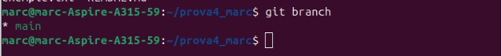
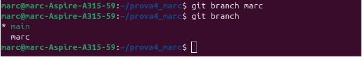
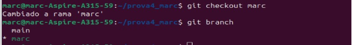
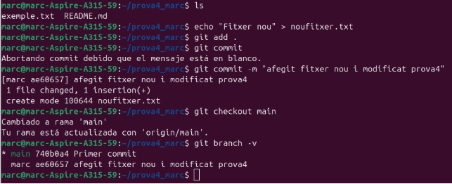
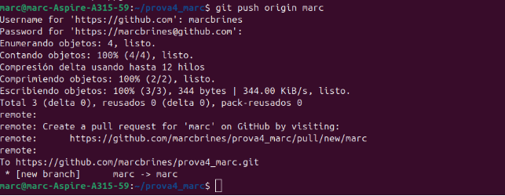
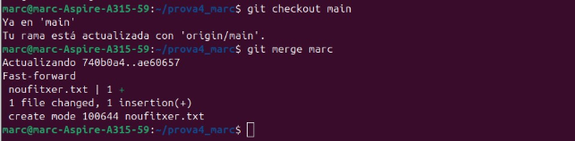
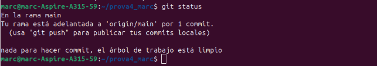

BRANQUES I UNIONS

Marc Brines Bañuls IAW 

Entrem en el directori que crearem l’altre dia , per a executar el comandament que llista les branques que hi tenim.

*Fig 1: Llista de branques.*

Aquesta es la branque que està treballant: \* main, i ara anem a crear una altra apart per a vore el procés de creació d’aquestes.

*Fig 2: Creació i llistat de branques.*

Ara anem a passar a l’altra branca per a comprovar que dins s’ha creat tot correctament.

*Fig 3: Vegem com hem cambiat a la branca marc.*

Ara vegem que estiga tot i afegim canvis, seguidament farem el commit i tornem a la branca main, finalment verifiquem ab¡mb lultim comandament de la imatge.

*Fig 4: Comandaments branques.*

Generem un token per a poder fer el push de la nova branca, copiem i una vegada executem ens demanarà usuari i en la contrasenya posem el token:

*Fig 5: Push de la nova branca.* Canviem de branca i després fusionem en la ultima creada.

*Fig 6: Fusió de la branca marc amb la main.* Fem un status per a vore com està després de fer les proves de abans

*Fig 7: Estat del git*
Marc Brines Bañuls IAW 

3
