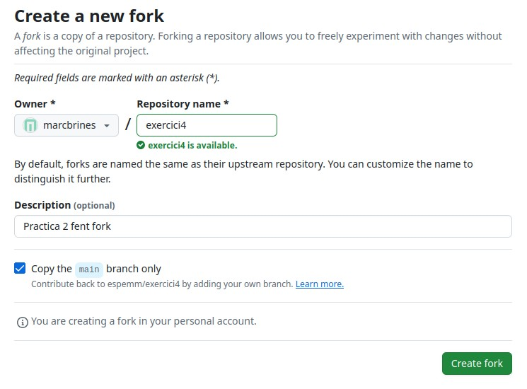
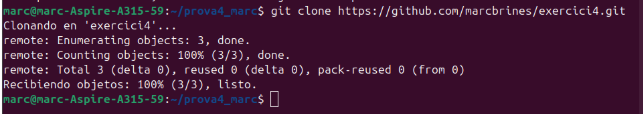
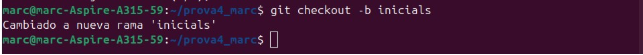
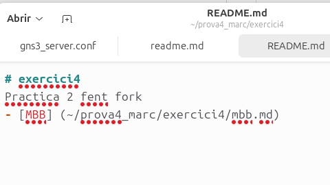
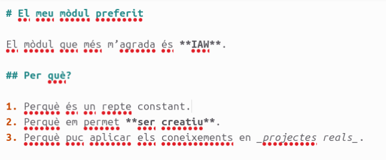
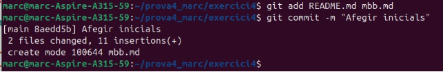
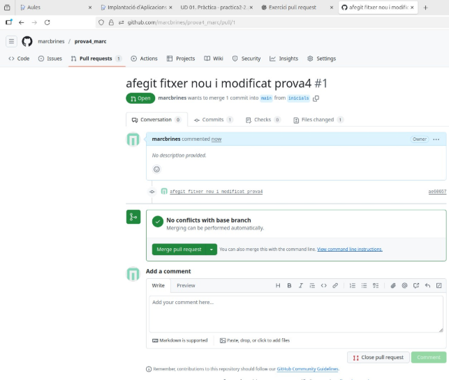
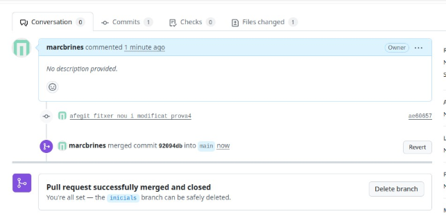
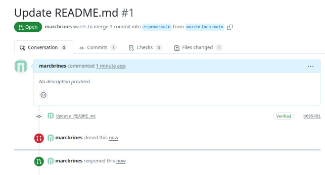

PULL REQUEST

Marc Brines Bañuls 2 ASIX IAW

Creació d’un nou fork, entrem en el github i dalt al cantó dret hi ha el botó de fer el fork.

*Fig 1: Creació de fork.*

Clonem en el nostre usuari el .git.

*Fig 2: Clonem el repositori.*

Cambiem a nova branca.

*Fig 3: Creem una rama nova.*

Editem el readme desde l’entorn gràfic, es a dir, desde la nostra màquina real ja que ho estem fent ahí.

*Fig 4: Afegir al readme l’ultima línea.*

*Fig 5: Creació del .md.* Afegim i fem un commit dels ultims canvis que hem fet

*Fig 6: Canvi i commit.*

Marc Brines Bañuls 4 ASIX IAW

4

*Captures finals de demostració i acceptació del exercici.*

**Fet en prova4\_marc per equivocació però el exercici està resolt.**
Marc Brines Bañuls 2 ASIX IAW

5
