MKDOCS-GITHUB

Marc Brines Bañuls 2 ASIX IAW

Començarem actualitzant l’equip per a que baixe tots els paquets necesaris i no ens done falla, seguidament instal·lem el mkdocs a través del cmd.

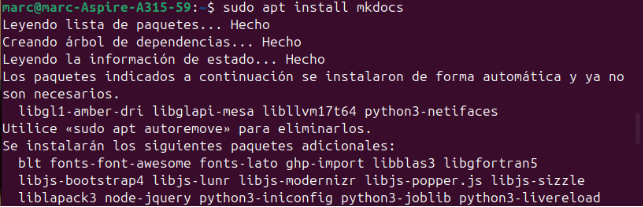

*Fig 1: Instalació.*

Lúltim pas està fet amb “sudo apt” perque a través del “pip” hem donava error i no hem permet baixar-ho.

Ara anem a crear un projecte amb mkdocs, aquest apart de fer un directori, també ens crearà un “.yaml” i un “.md”.

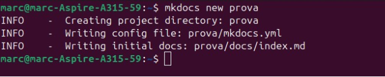

*Fig 2: Creació directori i fitxers.*

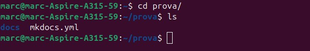

*Fig 3: Comprovació.*

Ara anem a editar el fitxer index, creant altre a banda, però enllaçat amb aquest ultim anomenat, per tal de fer proves.

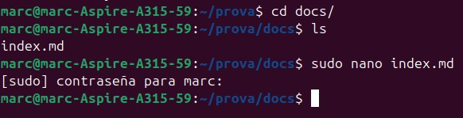

*Fig 4: Editant “index.md”.*

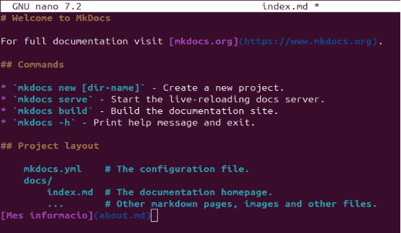

*Fig 5: Fitxer “index.md”.* Ara creem el fitxer on hem dirigit des de l’anterior.

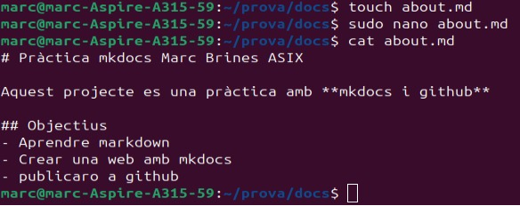

*Fig 6: Creació del fitxer enllaçat.*

Ara el que anem a fer es editar el yml, per tal de afegir les dues pàgines per a que apareguen les dues al menú de navegació.

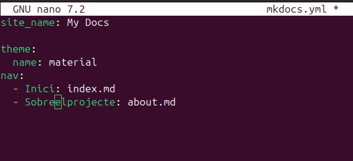

*Fig 7: Editant el fitxer yml.*

Ara amb el següent comandament anem a fer que, per el navegador, ens pugam conectar a la pàgina mkdocs que hem creat.

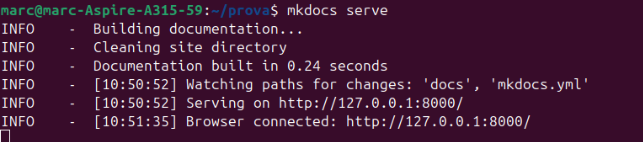

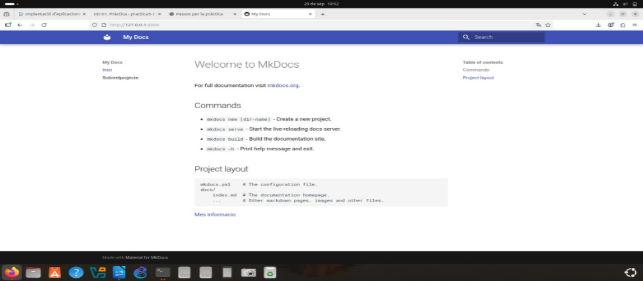

*Fig 8 i 9: Connexió amb la pàgina web.*

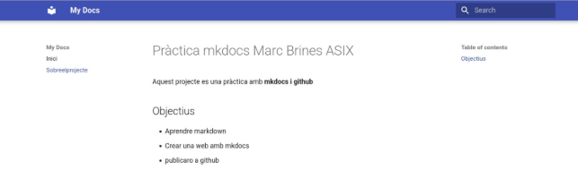

*Fig 10: Segon repositori creat.*

Ara anem a github per tal de crear la prova aon anem a pujar tot el treball fet, per tal de seguir amb la pràctica.

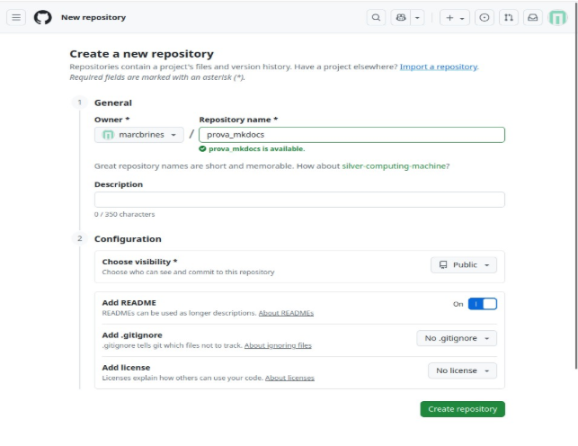

*Fig 11: Creació del repositori a GitHub.*

Inicialitzem el repositori git a la carpeta prova.

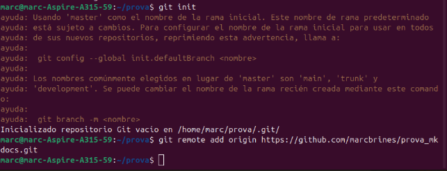

*Fig 12: Inicialitzant repositori.*

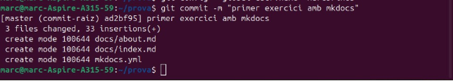

*Fig 13: Commit.*

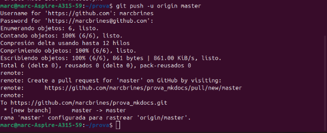

*Fig 14: Pujem la rama master.*

Executem el següent comandament per a que una vegada activem des de dins del repositori les “pages”, pugam entrar des del navegador.

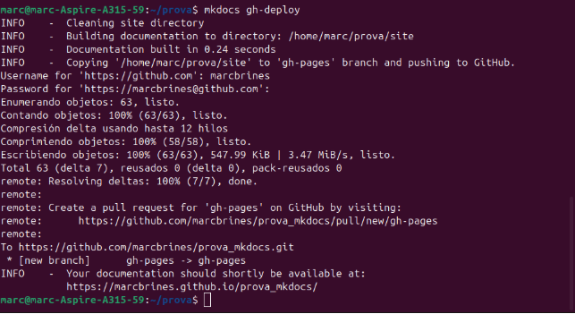

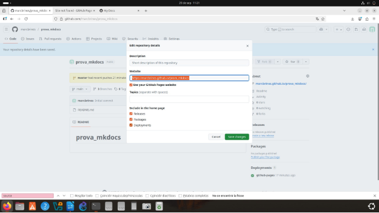

*Fig 15 i 16: Activació del enllaç per al navegador.*

Marc Brines Bañuls 7 ASIX IAW

7

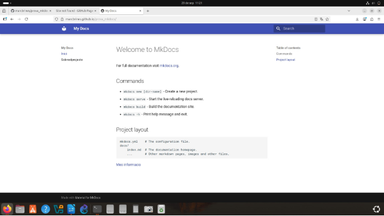

*Fig 17: Comprobació final.*
Marc Brines Bañuls 2 ASIX IAW

8
