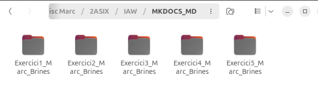
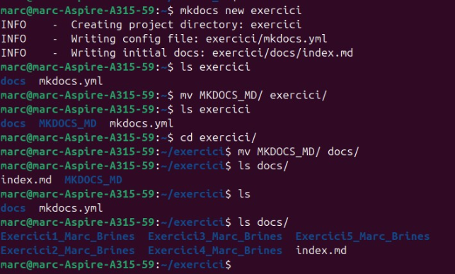
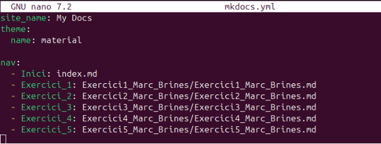
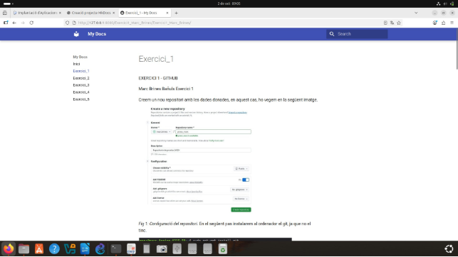
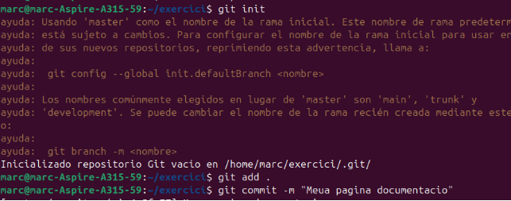
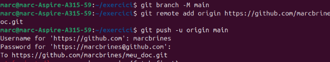
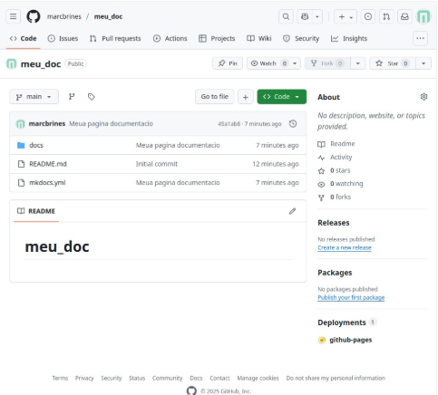
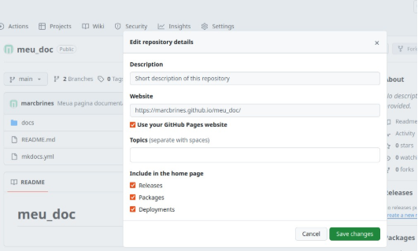
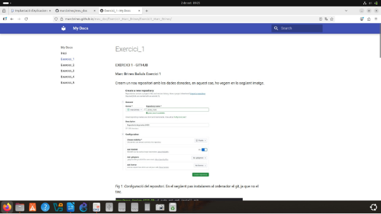

MKDOCS AMB LES MEUES PRÀCTIQUES

Marc Brines Bañuls 2 ASIX IAW

El primer pas, es pasar tots els documents que hem fet fins ara en .md per tal de poder fer la pràctica, jo en el meu cas, he ordenat una carpeta per a cada projecte amb les seues fotos i documents .md dins de la mateixa carpeta.

*Fig 1: Carpeta generada per als .md i imatges.*

Creem el mkdocs, on dins anem a copiar els nostres exercicis per tal de poder treballar ( he tingu un poc de lio pensant on tocava ficar-los per aixo hi ha tant de comandament )

*Fig 2: Creació i copia dels exercicis i mkdocs.*

Una vegada hem ficat els exercics, anem a modificar el .yml per a ficar el tema ( he ficat el mateix que l’ultima pràctica perque es el que tinc instal·lat ), i també les direccions a l’apartat nav.

*Fig 3: Fitxer .yml*

Ara provaré el mkdocs amb el meu navegador, executant “mkdocs serve” i entrant a la IP que et diu el comandament, así està el resultat.

*Fig 4: Resultat mkdocs.*

Fem els comandaments necesaris, que ja ens sabem per a pujar tot el que acabem de fer a git.

*Fig 5: Comandaments necesaris.*

*Fig 6: Comandaments necesaris.*

Finalment farem el mkdocs gh-deploy ( me se oblidat fer captura ), per a poder despres activar el link i veure amb l’enllaç que es veu en imatges següents, el meu treball.

Vegem que tot estiga correctament al nostre repositori.

*Fig 7: Comprovació a github.*

*Fig 8: Activació del URL.*

Marc Brines Bañuls 5 ASIX IAW

5

*Fig 9: Comprovació final.*
Marc Brines Bañuls 2 ASIX IAW

6
